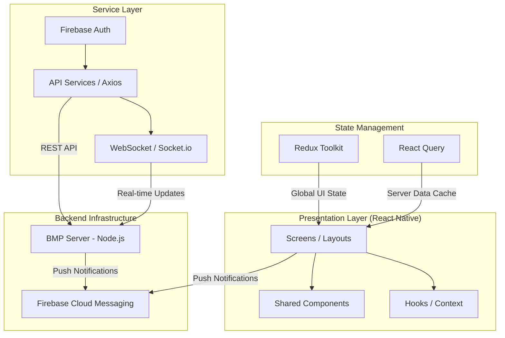

# BookMyPujari - Mobile Application

[](https://reactnative.dev/)
[](https://expo.dev/)
[](https://redux-toolkit.js.org/)
[](https://www.typescriptlang.org/)

Sacred Connect is a modern, high-performance mobile application built with React Native and Expo. It serves as a digital bridge between devotees and priests, enabling seamless booking of religious ceremonies, real-time communication, and secure payments.

---

## 🏗️ Architecture Overview

The application follows a modular architecture designed for scalability and maintainability. It leverages **Expo Router** for file-based navigation, **Redux Toolkit** for predictable state management, and **React Query** for efficient server-state synchronization.

### System Architecture Diagram



### Key Architectural Decisions
- **File-based Routing**: Using `expo-router` to manage navigation via the file system (`/app` directory).
- **Service-Oriented Logic**: All API calls and external integrations are abstracted into the `/services` and `/api` directories.
- **Atomic Components**: UI is built using reusable components in `/components`, ensuring a consistent design system.
- **Real-time Sync**: Integration with `socket.io-client` for live booking updates and chat features.

---

## 🚀 Tech Stack

- **Framework**: [Expo](https://expo.dev/) (SDK 54) / React Native
- **Navigation**: [Expo Router](https://docs.expo.dev/router/introduction/)
- **State Management**: [Redux Toolkit](https://redux-toolkit.js.org/) & [React Query](https://tanstack.com/query/latest)
- **Backend Integration**: [Firebase](https://firebase.google.com/) (Auth & Notifications)
- **Styling**: React Native StyleSheet & `expo-linear-gradient`
- **Real-time**: [Socket.io-client](https://socket.io/)
- **Payments**: [Razorpay](https://razorpay.com/)
- **Testing**: [Maestro](https://maestro.mobile.dev/) (E2E), [Jest](https://jestjs.io/) (Unit)

---

## 📂 Project Structure

```text
sacred-connect/
├── api/                # Axios instance and API endpoints
├── app/                # Expo Router file-based screens (Main navigation)
│   ├── (auth)/         # Authentication flow (Login, Register)
│   ├── (tabs)/         # Bottom tab navigation screens
│   └── ...             # Dynamic routes and stacks
├── assets/             # Images, fonts, and static resources
├── components/         # Reusable UI components (Atomic design)
├── context/            # React Context providers (Auth, Theme)
├── hooks/              # Custom React hooks
├── redux/              # Redux slices and store configuration
├── services/           # External service integrations (Firebase, WebSocket)
├── types/              # TypeScript interfaces and types
└── utils/              # Helper functions and constants
```

---

## 🛠️ Getting Started

### Prerequisites
- Node.js (v18+)
- Watchman (for macOS)
- Expo Go app on your phone or an Android/iOS emulator

### Installation
1. Clone the repository
2. Navigate to the frontend directory:
   ```bash
   cd sacred-connect
   ```
3. Install dependencies:
   ```bash
   npm install
   ```

### Running the App
Start the development server:
```bash
npx expo start
```
- Press `a` for Android Emulator
- Press `i` for iOS Simulator
- Press `w` for Web
- Scan the QR code with **Expo Go** to run on a physical device.

---

## 🔐 Test Credentials

Use these accounts to test the application flows.

| Role               | Email                     | Password      |
|:-------------------|:--------------------------|:--------------|
| **Priest (North)** | `priest1@example.com`     | `password123` |
| **Priest**         | `sharmaji@mailinator.com` | `Anish@123`   |
| **Priest (South)** | `priest2@example.com`     | `password123` |
| **Devotee**        | `devotee1@example.com`    | `password123` |
| **Demo User**      | `demo@example.com`        | `Anish@123`   |

---

## 🧪 Testing

We use **Maestro** for end-to-end mobile automation.

- Run full suite: `npm test`
- Run specific flows:
  - `npm run test:mobile:success` - Successful booking
  - `npm run test:mobile:payment` - Payment flow
  - `npm run test:mobile:rating` - User feedback flow

Refer to [TESTING.md](./TESTING.md) for more details.

---

## 📚 Documentation

- [Priest Onboarding Guide](./docs/PRIEST_README.md) - Detailed flow for priest registration
- [Component Documentation](./docs/README.md) - Overview of UI components
- [Testing Guide](./TESTING.md) - Mobile and Web testing strategies

---

## 📄 License
Internal Project - All Rights Reserved.
