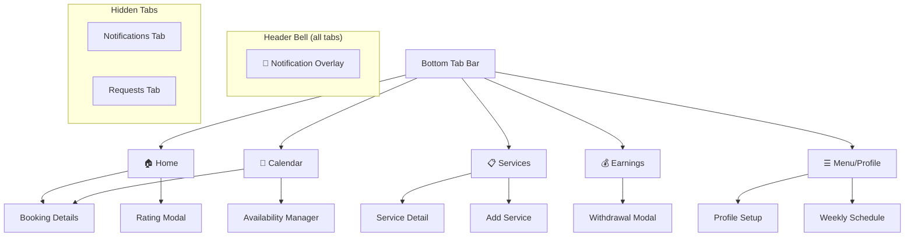
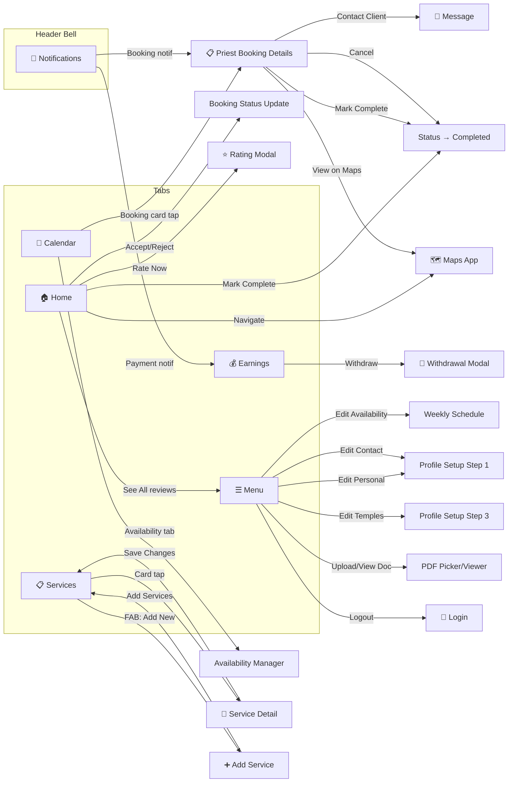

# Priest UI/UX Complete Map — Sacred Connect

## Overview

The priest experience is organized around a **5-tab bottom navigation** bar (Home, Calendar, Services, Earnings, Menu) with hidden screens for Notifications, Requests, and dedicated sub-screens for service management, booking details, and profile setup.

---

## 1. Bottom Tab Bar

| Tab | Icon | Label | Route |
|-----|------|-------|-------|
| **Home** | `home-outline` | Home | `priest/(tabs)/HomeTab` |
| **Calendar** | `calendar-outline` | Calendar | `priest/(tabs)/CalendarTab` |
| **Services** | `list-outline` | Services | `priest/(tabs)/ServicesTab` |
| **Earnings** | `cash-outline` | Earnings | `priest/(tabs)/EarningsTab` |
| **Menu** | `menu-outline` | Menu | `priest/(tabs)/ProfileTab` |

> **Note:** Notifications and Requests tabs exist but are hidden from the tab bar (`href: null`). They are accessible via direct navigation.

### Global: Notification Bell 🔔

A notification bell icon appears in the header of **all tabs**. Tapping it opens a floating overlay dropdown with:
- List of notifications (read/unread status)
- Tappable items that navigate to `PriestBookingDetails` (booking type) or `EarningsTab` (earnings type)
- Unread count badge (red dot)
- Tap outside to dismiss

---

## 2. Home Tab — `HomeTab.tsx`

The priest's dashboard. Fully scrollable with the following sections:

### Layout & Sections

| # | Section | Description |
|---|---------|-------------|
| 1 | **Header** | Gradient banner with "Welcome back, {name}" + 🔔 notification bell |
| 2 | **Profile Completion Banner** | Progress bar (shown if < 100%), links to profile setup |
| 3 | **Status Toggle** | Online/Offline/Busy toggle component |
| 4 | **Pending Actions** | Horizontal carousel of actionable cards |
| 5 | **Dashboard Grid** | 4 stat cards in 2×2 grid |
| 6 | **Up Next** | Next confirmed booking card |
| 7 | **Recent Love** | Horizontal scroll of recent review cards |
| 8 | **Pending Requests** | Horizontal scroll of pending booking requests |
| 9 | **Empty State** | "No upcoming activity" when no bookings/requests |

### Dashboard Grid Stats

| Stat | Value Source |
|------|-------------|
| 💰 **This Month** | `earnings.thisMonth` |
| 💵 **Balance** | `earnings.availableBalance` |
| ✅ **Pujas Completed** | `earnings.pujasCompleted` (green) |
| ⏳ **Pujas Pending** | `earnings.pujasPending` (yellow) |

### Pending Actions Cards

| Action Type | Icon | Button | Action |
|-------------|------|--------|--------|
| **Mark Complete** | `checkmark-circle-outline` (blue) | "Mark Complete" | Updates booking to `completed` status |
| **Rate Devotee** | `star-outline` (yellow) | "Rate Now" | Opens `RatingModal` |

### Up Next Card

Shows the nearest confirmed booking with: ceremony type, devotee name, date/time, location.

| Button | Action |
|--------|--------|
| 🧭 **Navigate** | Opens Maps app with booking location |

### Pending Requests Cards

Each request card shows: ceremony type, devotee name, date.

| Button | Action |
|--------|--------|
| ❌ **Reject** | Cancels booking |
| ✅ **Accept** | Confirms booking |

### Recent Love

Horizontal scroll of latest 4 review cards with reviewer avatar, name, star rating, and comment. 

| Button | Action |
|--------|--------|
| **See All** | → Profile Tab (reviews section) |

---

## 3. Calendar Tab — `CalendarTab.tsx`

Dual-mode calendar view with tab toggle at the top.

### Layout

| # | Section | Description |
|---|---------|-------------|
| 1 | **Mode Toggle** | "Bookings" / "Availability" tab buttons |
| 2 | **Calendar** (Bookings mode) | Expandable calendar with blue dots on booked dates |
| 3 | **Agenda List** (Bookings mode) | Date-grouped confirmed booking cards |
| 4 | **Availability Manager** (Availability mode) | Weekly schedule editor component |

### Bookings Mode

| Element | Description |
|---------|-------------|
| **Calendar widget** | Expandable/collapsible, marked dates, today button |
| **Booking card** | Time stripe (left) + ceremony name, client, location |
| **Card tap** | → `PriestBookingDetails` screen |

### Availability Mode

| Element | Description |
|---------|-------------|
| **AvailabilityManager** | Component for managing weekly availability slots |

---

## 4. Services Tab — `ServicesTab.tsx`

Manages the priest's offered ceremonies/pujas.

### Layout

| # | Section | Description |
|---|---------|-------------|
| 1 | **Service Cards** | FlatList of image-background cards |
| 2 | **FAB** | Floating Action Button "➕ Add New" |

### Service Card Features

| Element | Description |
|---------|-------------|
| **Background image** | Ceremony image with dark overlay |
| **Service name** | Large white text |
| **Active toggle** | Switch to enable/disable the service |
| **Base Price** | Displayed in bottom-left |
| **Details button** | Pill button → `ServiceDetailScreen` |
| **Inactive styling** | Reduced opacity when toggled off |

### Buttons & Actions

| Button | Action |
|--------|--------|
| 🔄 **Active Toggle** | Enables/disables service (saves to backend) |
| **Details →** | → `ServiceDetailScreen` |
| ➕ **Add New** (FAB) | → `AddServiceScreen` |

---

## 5. Earnings Tab — `EarningsTab.tsx`

Financial overview and withdrawal management.

### Layout

| # | Section | Description |
|---|---------|-------------|
| 1 | **Earnings Summary** | Card with total earnings + period toggle |
| 2 | **Withdraw Button** | Full-width primary button |
| 3 | **Recent Transactions** | List of transaction cards |

### Earnings Summary Card

| Element | Description |
|---------|-------------|
| **Period toggle** | "Previous" / "Current" month selector |
| **Total amount** | Large formatted currency (₹) |
| **Growth indicator** | ↑/↓ percentage vs last month (green/red) |

### Withdraw Earnings Modal

| Element | Description |
|---------|-------------|
| **Available Balance** | Displayed at top |
| **Amount input** | Numeric input for withdrawal amount |
| **Payment Method** | Radio buttons: UPI / Credit/Debit Card |
| **Withdraw Funds** | Submit button (validates amount ≤ balance) |
| ✖️ **Close** | Dismiss modal |

### Transaction Card

Each card shows: description, amount (₹), client name, date, and status (Completed ✓).

---

## 6. Menu / Profile Tab — `ProfileTab.tsx`

Comprehensive profile management screen.

### Layout (Scrollable)

| # | Section | Description |
|---|---------|-------------|
| 1 | **Profile Header** | Avatar (with camera edit button), name, rating stars, role + experience, completion bar |
| 2 | **Personal Details** | Name, experience, tradition, languages, description, location + Edit button |
| 3 | **Availability** | Weekly schedule display + Edit button |
| 4 | **Verification Documents** | Government ID + Religious Certificate with upload/view/re-upload |
| 5 | **Temple Affiliation** | List of affiliated temples + Edit button |
| 6 | **Contact Information** | Phone + Email + Edit button |
| 7 | **Reviews** | Latest 5 reviews with ratings, comments, tags + "See all reviews" |
| 8 | **Logout** | Red bordered logout button |

### Buttons & Actions

| Button | Location | Action |
|--------|----------|--------|
| 📷 **Camera** | Profile avatar | → `ProfileSetup` (editing mode) |
| ✏️ **Edit** (Personal Details) | Section header | → `ProfileSetup` step 1 (personal details) |
| ✏️ **Edit** (Availability) | Section header | → `WeeklySchedule` editor |
| ✏️ **Edit** (Temple Affiliation) | Section header | → `ProfileSetup` step 3 |
| ✏️ **Edit** (Contact Info) | Section header | → `ProfileSetup` step 1 (contact) |
| 📄 **Upload PDF** | Document row | Opens document picker (PDF only) |
| 👁️ **View** | Document row (if uploaded) | Downloads & opens PDF in viewer |
| 📄 **Re-upload** | Document row (if uploaded) | Opens document picker to replace |
| **See all reviews** | Reviews section | Scroll indicator |
| 🚪 **Logout** | Bottom | Confirmation dialog → clears auth → `/login` |

---

## 7. Sub-Screens

### 7.1 Notifications Tab (Hidden) — `NotificationsTab.tsx`

| Element | Description |
|---------|-------------|
| **Header** | "Notifications" title + "Mark all as read" button |
| **Notification list** | FlatList with pull-to-refresh |
| **Notification card** | Icon (color-coded by type), title, message, relative time |
| **Unread indicator** | Left border highlight on unread items |

**Notification types & icons:**

| Type | Icon | Color | Tap Action |
|------|------|-------|------------|
| **Booking** | `calendar` | Primary | → `PriestBookingDetails` |
| **Payment** | `wallet` | Green | → `EarningsTab` |
| **Reminder** | `alarm` | Yellow | — |

---

### 7.2 Requests Tab (Hidden) — `RequestsTab.tsx`

| Element | Description |
|---------|-------------|
| **Header** | "Booking Requests" title |
| **Request cards** | FlatList with pull-to-refresh |

**Request Card Details:**

Each card shows: devotee avatar + name + rating, request date, price tag (₹), ceremony name, booking date/time/location.

| Button | Action |
|--------|--------|
| ❌ **Reject** | Cancels the booking with "Priest is unavailable" note |
| ✅ **Accept** | Confirms the booking |

---

### 7.3 Service Detail — `ServiceDetailScreen.tsx`

| Section | Description |
|---------|-------------|
| **Hero Image** | Full-width ceremony image (300px) |
| ← **Back** | Floating back button |
| **Title** | Ceremony name |
| **Duration** | Approximate time in minutes |
| **About this Puja** | Read-only ceremony description |
| **House Requirements** | Space requirements (read-only from ceremony) |
| **Participants** | Min/Max participants (read-only) |
| **Your Pricing** | Editable price input (₹) |
| **Standard Items** | Read-only material list from ceremony definition |
| **Your Additional Requirements** | Editable list — add/remove custom requirements |

| Button | Condition | Action |
|--------|-----------|--------|
| ➕ **Add** | Requirement input | Adds item to requirements list |
| ✖️ **Remove** | Per requirement item | Removes from list |
| 💾 **Save Changes** | Footer, only when changes exist | Saves price + requirements to backend |

---

### 7.4 Add Service — `AddServiceScreen.tsx`

| Element | Description |
|---------|-------------|
| ← **Back** | Returns to Services tab |
| **Header** | "Add New Service" |
| 🔍 **Search bar** | Filter ceremonies by name |
| **Ceremony list** | All available ceremonies minus already-added ones |
| **Ceremony card** | Name + description; tap to toggle selection (checkmark + orange highlight) |
| **Footer** | "Add X Services" button |

| Button | Action |
|--------|--------|
| **Ceremony card tap** | Toggles selection |
| **Add X Services** | Saves selected ceremonies (default price ₹0) → returns to Services tab |

---

### 7.5 Priest Booking Details — `PriestBookingDetails.tsx`

| Section | Content |
|---------|---------|
| **Status Badge** | Color-coded (green/blue/red/yellow) |
| **Ceremony Details** | Type, date, time range |
| **Client Information** | Name, phone number |
| **Location** | Address, city, "View on Maps" button |
| **Payment Details** | Base price, platform fee, total, payment status, payment method |

| Button | Condition | Action |
|--------|-----------|--------|
| ✅ **Mark as Completed** | Status = confirmed | Updates booking to `completed` |
| ❌ **Cancel Booking** | Status = confirmed | Updates booking to `cancelled` |
| 💬 **Contact Client** | Always visible | Initiates contact |
| 🗺️ **View on Maps** | Location section | Opens maps app |

---

### 7.6 Profile Setup (4-Step Wizard) — `ProfileSetup.tsx`

Multi-step form for initial setup and profile editing.

| Step | Title | Fields |
|------|-------|--------|
| **1** | Personal Details | Profile picture, name, phone, email, experience, religious tradition, description, languages (picker), location (auto-detect) |
| **2** | Services | Browse & select ceremonies, set prices per ceremony |
| **3** | Temple Affiliation | Add/remove temples (name + address) |
| **4** | Availability | Toggle days on/off, set start/end times per day, "Apply to all days" option, default times button |

| Button | Action |
|--------|--------|
| ← **Back** | Previous step |
| **Next** | Next step (with validation) |
| **Submit** | Saves all data to backend → returns to Profile |
| 📷 **Pick Image** | Image picker for profile photo |
| 📍 **Get Location** | Auto-detect current GPS coordinates |

---

### 7.7 Weekly Schedule Editor — `weekly-schedule.tsx`

Re-exports the `WeeklyTemplateEditor` component for editing weekly availability. Accessible from the Profile Tab's Availability "Edit" button.

---

## 8. Complete Navigation Flow

---

## 9. Summary of Everything a Priest Can Do

| # | Capability | Where |
|---|-----------|-------|
| 1 | View dashboard stats (earnings, pujas completed/pending) | Home → Dashboard Grid |
| 2 | Toggle availability status (Online/Offline/Busy) | Home → Status Toggle |
| 3 | Mark bookings as completed | Home (Pending Actions) or Booking Details |
| 4 | Rate devotees after ceremonies | Home (Pending Actions) → Rating Modal |
| 5 | Accept/reject booking requests | Home (Pending Requests) or Requests Tab |
| 6 | Navigate to next booking location | Home → Up Next → Navigate |
| 7 | View recent reviews | Home → Recent Love section |
| 8 | View confirmed bookings on calendar | Calendar → Bookings mode |
| 9 | Manage weekly availability schedule | Calendar → Availability mode |
| 10 | View booking details (ceremony, client, location, payment) | Calendar card tap → Booking Details |
| 11 | View and manage offered services | Services Tab |
| 12 | Toggle services active/inactive | Services → Active toggle switch |
| 13 | Edit service pricing | Services → Service Detail → Price input |
| 14 | Add/remove service requirements | Services → Service Detail |
| 15 | Add new ceremonies to service list | Services → FAB → Add Service |
| 16 | View earnings (current/previous month) | Earnings Tab |
| 17 | Request withdrawal (UPI/Card) | Earnings → Withdraw → Modal |
| 18 | View transaction history | Earnings → Recent Transactions |
| 19 | Edit personal details (name, experience, tradition, languages, etc.) | Menu → Edit → Profile Setup |
| 20 | Upload/view/re-upload verification documents (Government ID, Religious Certificate) | Menu → Documents section |
| 21 | Manage temple affiliations | Menu → Edit → Profile Setup Step 3 |
| 22 | Edit weekly schedule | Menu → Availability Edit → Weekly Schedule |
| 23 | View profile completion progress | Menu/Home → Completion banner |
| 24 | View all reviews received | Menu → Reviews section |
| 25 | View notifications (booking, payment, reminders) | Bell icon overlay or Notifications Tab |
| 26 | Mark notifications as read (single/all) | Notifications Tab |
| 27 | Contact client from booking | Booking Details → Contact Client |
| 28 | Get directions to ceremony location | Booking Details → View on Maps |
| 29 | Cancel confirmed bookings | Booking Details → Cancel Booking |
| 30 | Logout | Menu → Logout button |
