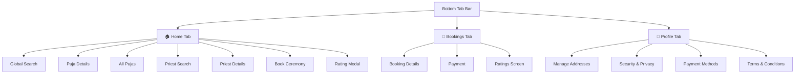
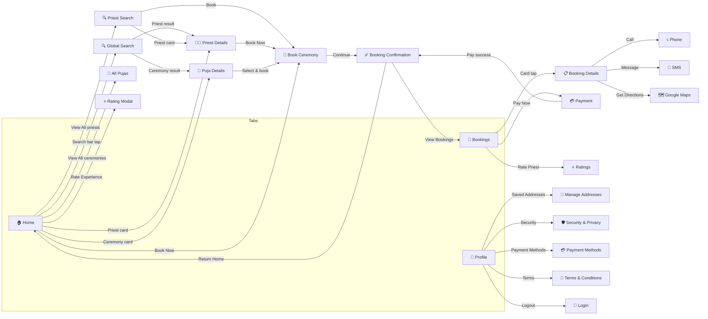

# Devotee UI/UX Complete Map — Sacred Connect

## Overview

The devotee experience is organized around a **3-tab bottom navigation** bar (Home, Bookings, Profile) with deep-linked sub-screens for search, booking, payment, ratings, and account management.

---

## 1. Bottom Tab Bar

| Tab | Icon | Route |
|-----|------|-------|
| **Home** | `home-outline` | `devotee/(tabs)/HomeTab` |
| **Bookings** | `calendar-outline` | `devotee/(tabs)/BookingsTab` |
| **Profile** | `person-outline` | `devotee/(tabs)/ProfileTab` |

---

## 2. Home Tab — `HomeTab.tsx`

The landing screen after login. Scrollable, with the following sections top-to-bottom:

### Layout & Sections

| # | Section | Description |
|---|---------|-------------|
| 1 | **Header** | Gradient primary-color banner with "Welcome, {name}", tagline "Find the Perfect Priest" |
| 2 | **Search Bar** | Tappable search bar → navigates to **Global Search** |
| 3 | **Pending Actions** | Horizontal carousel of pending "Rate Experience" cards (shown only if pending actions exist) |
| 4 | **Popular Ceremonies** | Horizontal scroll of ceremony image cards + "View All" dashed card |
| 5 | **Recommended Priests** | Vertical list of priest cards with name, religion, experience, rating, services, and a **"Book Now"** button |

### Buttons & Actions

| Button/Element | Location | Action |
|----------------|----------|--------|
| 🔍 **Search Bar** | Below header | → `GlobalSearch` screen |
| ⭐ **Rate Experience** | Pending actions card | Opens `RatingModal` to rate a priest |
| 🖼️ **Ceremony Card** | Popular Ceremonies | → `/(pujas)/{ceremonyId}` (Puja Details) |
| ➡️ **View All** (ceremonies) | End of ceremonies scroll | → `AllPujas` screen |
| 👤 **Priest Card** | Recommended Priests | → `PriestDetails?priestId=` |
| 📗 **Book Now** | Right side of priest card | → `BookCeremony?priestId=` |
| 🔗 **View All** (priests) | Section header | → `PriestSearch` screen |

---

## 3. Bookings Tab — `BookingsTab.tsx`

Manages all devotee bookings with filtering and contextual actions.

### Layout

| # | Section | Description |
|---|---------|-------------|
| 1 | **Header** | "My Bookings" title + 🔄 Refresh button |
| 2 | **Filter Bar** | Horizontal pill filters: All, Upcoming, Pending, Past (each shows count) |
| 3 | **Booking List** | FlatList of booking cards with pull-to-refresh |
| 4 | **Empty State** | Calendar icon + "Find Priests" button when no bookings |

### Booking Card Details

Each card shows: ceremony type, status badge (color-coded), priest name, payment status, date/time/location, and amount.

### Conditional Action Buttons per Card

| Booking Status | Button(s) | Action |
|---------------|-----------|--------|
| **Pending** | 💳 **Pay Now** | → `Payment` screen |
| **Confirmed** (unpaid) | 💳 **Pay Advance** / **Pay Remaining** | → `Payment` screen |
| **Confirmed** (paid) | 👁️ **View Details** | → `BookingDetails` screen |
| **Completed** (unrated) | ⭐ **Rate Priest** | → `Ratings` screen |
| **Completed** (rated) | 👁️ **View Details** | → `BookingDetails` screen |
| **Cancelled** | 👁️ **View Details** | → `BookingDetails` screen |

> **Note:** Tapping the entire card also opens **Booking Details**.

---

## 4. Profile Tab — `ProfileTab.tsx`

Account management and settings.

### Layout

| # | Section | Description |
|---|---------|-------------|
| 1 | **Header** | "Profile" title + ❓ Help button (→ `/Help`) |
| 2 | **Profile Card** | Avatar image, user name |
| 3 | **Personal Information** | Read-only display of Email and Phone |
| 4 | **Notification Preferences** | 3 toggle switches |
| 5 | **Account Menu** | 5 navigation links |
| 6 | **Logout** | Red bordered logout button |
| 7 | **Version Info** | "Sacred Connect v1.0.0" |

### Notification Toggles

| Toggle | Default | Purpose |
|--------|---------|---------|
| Upcoming Bookings | ✅ On | Ceremony reminders |
| Booking Confirmations | ✅ On | Confirmation & update alerts |
| Promotions & News | ❌ Off | Marketing updates |

### Account Menu Items

| Item | Icon | Destination |
|------|------|-------------|
| 📍 **Saved Addresses** | `location-outline` | → `ManageAddresses` |
| 🛡️ **Security & Privacy** | `shield-checkmark-outline` | → `SecurityAndPrivacy` |
| 💳 **Payment Methods** | `card-outline` | → `PaymentMethods` |
| ❓ **Help & Support** | `help-circle-outline` | → `/Help` |
| 📄 **Terms & Conditions** | `document-text-outline` | → `TermsAndConditions` |

### Other Buttons

| Button | Action |
|--------|--------|
| 🚪 **Logout** | Confirmation dialog → clears auth → `/login` |

---

## 5. Sub-Screens

### 5.1 Global Search — `GlobalSearch.tsx`

| Element | Description |
|---------|-------------|
| ← **Back** button | Returns to Home |
| 🔍 **Search input** | Auto-focus, debounced (500ms), searches priests + ceremonies |
| ✖️ **Clear** button | Clears search text |
| **Ceremonies section** | Cards showing image, name, description → tap goes to Puja Details |
| **Priests section** | Cards showing image, name, tradition, experience → tap goes to Priest Details |

---

### 5.2 Priest Search — `PriestSearch.tsx`

| Element | Description |
|---------|-------------|
| ← **Back** | Returns to previous screen |
| ⚙️ **Filter toggle** | Shows/hides filter panel |
| 🔍 **Search bar** | Live debounced search by priest name |
| **Ceremony chips** | Wedding, Grih Pravesh, Baby Naming, etc. |
| **Religion chips** | Hinduism, Buddhism, Jainism, Sikhism |
| **Rating chips** | 4.5+, 4.0+, 3.5+, Any rating |
| **Clear All** | Resets all filters |
| **Apply Filters** | Applies selected filters and closes panel |
| **Priest cards** | Image, name, tradition, rating, ceremonies, availability indicator |
| 📗 **Book** button | On each priest card → `BookCeremony` |

---

### 5.3 Priest Details — `PriestDetails.tsx`

| Element | Description |
|---------|-------------|
| ← **Back** | Returns to previous screen |
| 📤 **Share** button | Share priest profile (header right) |
| **Profile section** | Photo, name, tradition, experience, rating, availability status |
| **4 inner tabs** | About · Ceremonies · Reviews · Availability |

**Tab contents:**

| Tab | Shows |
|-----|-------|
| **About** | Description, Temple Affiliation, Languages (badges), Certifications (checkmarks) |
| **Ceremonies** | List of ceremony names + prices (₹) |
| **Reviews** | Overall rating + individual review cards with star ratings |
| **Availability** | Weekly schedule (day → time range or "Not Available") |

**Sticky Footer:**

| Element | Description |
|---------|-------------|
| "Starting from ₹X" | Min price from ceremonies |
| 📗 **Book Now** / "Not Available" | → `BookCeremony` (disabled if unavailable) |

---

### 5.4 Book Ceremony — `[BookCeremony].tsx`

Multi-step booking wizard:

| Step | What the devotee does |
|------|-----------------------|
| **Select Ceremony** | Choose from priest's available ceremonies |
| **Select Date** | Calendar picker component |
| **Select Time** | Choose from available time slots |
| **Select Address** | Pick from saved addresses or enter new |
| **Special Requests** | Optional text input |
| **Continue** | Validates all fields → creates booking → navigates to `BookingConfirmation` |

---

### 5.5 Booking Confirmation — `BookingConfirmation.tsx`

| Section | Content |
|---------|---------|
| ✅ **Success banner** | Green checkmark + "Booking Successful!" |
| **Booking Details** | Booking ID, Ceremony, Priest, Date, Time, Venue |
| **Payment Info** | Method, Payment ID, Status, Amount breakdown (base + platform fee = total) |
| **What's Next?** | 3-step instructions (priest contact, prepare venue, 24hr reminder) |

| Button | Action |
|--------|--------|
| 📤 **Share** | Native share dialog |
| 📅 **View My Bookings** | → Bookings Tab |
| 🏠 **Return to Home** | → Home Tab |

---

### 5.6 Booking Details — `BookingDetails.tsx`

| Section | Content |
|---------|---------|
| **Status Badge** | Color-coded (green/yellow/blue/red) + Booking ID |
| **Ceremony Details** | Image, name, type, duration |
| **Schedule** | Date + Time range |
| **Devotee Info** | Name, email, 📞 Call + 💬 Message buttons |
| **Location** | Address, landmark, 🗺️ **Get Directions** (Google Maps) |
| **Payment Details** | Total, Advance paid, Remaining, Payment status |
| **Special Requests** | Displayed if present |

| Button (if pending) | Action |
|---------------------|--------|
| ✅ **Confirm Booking** | Confirm the booking |
| ❌ **Cancel Booking** | Cancel the booking |
| ← **Back to All Bookings** | → Bookings Tab |

---

### 5.7 Payment — `Payment.tsx`

| Element | Description |
|---------|-------------|
| **Booking summary** | Ceremony, priest, date/time |
| **Amount breakdown** | Base price, platform fee, total |
| **Payment method tabs** | UPI / Card |
| **Card form** | Number, Expiry (MM/YY), CVV inputs |
| 💳 **Pay ₹X** button | Processes payment → navigates to `BookingConfirmation` |

---

### 5.8 Ratings — `Ratings.tsx`

| Element | Description |
|---------|-------------|
| Priest info card | Photo, name, specialization |
| **Star ratings** | Overall + category ratings (Punctuality, Knowledge, Behavior) |
| **Review text** | Multi-line input for written review |
| **Tags** | Selectable feedback tags |
| ⭐ **Submit Rating** | Submits review to backend |

---

### 5.9 Manage Addresses — `ManageAddresses.tsx`

| Element | Description |
|---------|-------------|
| List of saved addresses | Each with edit/delete options |
| ➕ **Add New Address** | → `AddEditAddress` screen |

### 5.10 Security & Privacy — `SecurityAndPrivacy.tsx`

| Section | Features |
|---------|----------|
| **Change Password** | Modal with current/new/confirm password fields |
| **Security Settings** | Toggles for biometric auth, 2FA, login alerts |
| **Privacy Settings** | Toggles for profile visibility, data sharing, activity status |
| 🗑️ **Delete Account** | Confirmation dialog → permanent account deletion |

---

## 6. Complete Navigation Flow

---

## 7. Summary of Everything a Devotee Can Do

| # | Capability | Where |
|---|-----------|-------|
| 1 | Search priests & ceremonies globally | Home → Search Bar → Global Search |
| 2 | Browse popular ceremonies | Home → Popular Ceremonies section |
| 3 | View all available pujas | Home → View All → All Pujas |
| 4 | View puja details | Home / Search → Ceremony card |
| 5 | Browse recommended priests | Home → Recommended Priests |
| 6 | Search & filter priests | Home → View All → Priest Search |
| 7 | View priest profile (about, ceremonies, reviews, availability) | Priest Details (4 tabs) |
| 8 | Book a ceremony with a priest | Home/Search → Book Now → Book Ceremony wizard |
| 9 | Select ceremony, date, time, address, add special requests | Book Ceremony screen |
| 10 | Make payments (UPI/Card) | Bookings → Pay Now → Payment |
| 11 | View booking confirmation & share | After payment → Booking Confirmation |
| 12 | View all bookings (filtered by status) | Bookings Tab |
| 13 | View detailed booking info | Bookings → Card tap → Booking Details |
| 14 | Call/message priest from booking | Booking Details → Call/Message buttons |
| 15 | Get directions to ceremony location | Booking Details → Get Directions |
| 16 | Rate & review a priest | Home (Pending Actions) or Bookings (Rate Priest) |
| 17 | Manage saved addresses | Profile → Saved Addresses |
| 18 | Change password | Profile → Security & Privacy |
| 19 | Toggle biometric/2FA/login alerts | Profile → Security & Privacy |
| 20 | Manage privacy settings | Profile → Security & Privacy |
| 21 | Delete account | Profile → Security & Privacy |
| 22 | Configure notification preferences | Profile → Toggles |
| 23 | View payment methods | Profile → Payment Methods |
| 24 | Read terms & conditions | Profile → Terms & Conditions |
| 25 | Logout | Profile → Logout button |
