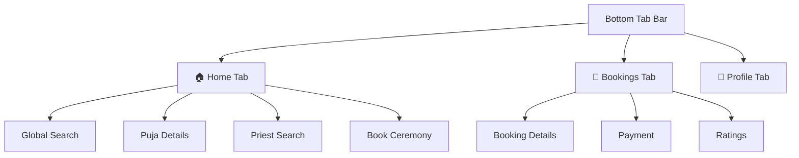
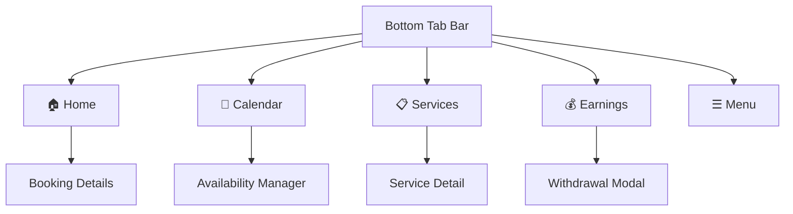

# UI/UX Architecture Map — Sacred Connect

This document provides a complete map of the user experience for both Devotees and Priests, including navigation flows, screen layouts, and feature capabilities.

---

## 1. Devotee Experience

The devotee experience is built around a **3-tab bottom navigation** bar with deep-linked screens for searching, booking, and management.

### 1.1 Navigation Structure

### 1.2 Core Capabilities
| Feature | Description |
| :--- | :--- |
| **Global Search** | Search for priests and ceremonies simultaneously with live filtering. |
| **Booking Wizard** | Multi-step process to select ceremony, date, time, and address. |
| **Payments** | Integrated UPI and Card payment flows for booking advances and balances. |
| **Ratings** | Detailed feedback system for rating priests across Punctuality, Knowledge, and Behavior. |

---

## 2. Priest Experience

The priest experience is specialized for service management and schedule tracking, using a **5-tab bottom navigation** bar.

### 2.1 Navigation Structure

### 2.2 Core Capabilities
| Feature | Description |
| :--- | :--- |
| **Service Management** | Add/Remove ceremonies, set custom pricing, and define material requirements. |
| **Status Toggle** | Live "Online/Offline/Busy" toggle to control visibility in search results. |
| **Earnings & Payouts** | Track monthly growth, view transaction history, and request balance withdrawals. |
| **Availability** | Manage weekly time slots and specific date overrides via a calendar-integrated editor. |

---

## 3. Shared Global Features

Both user types share several core infrastructure features:

*   **Notifications**: Header bell icon with real-time alerts for booking updates and payments.
*   **Authentication**: Unified login screen with auto-detection for email/phone identifiers.
*   **Security**: Biometric toggle, password management, and account deletion options.
*   **Verification**: Document upload and status tracking for government IDs and certificates.

---

## 4. Route Mapping Reference

| Role | Tab | Route |
| :--- | :--- | :--- |
| **Devotee** | Home | `devotee/(tabs)/HomeTab` |
| **Devotee** | Bookings | `devotee/(tabs)/BookingsTab` |
| **Devotee** | Profile | `devotee/(tabs)/ProfileTab` |
| **Priest** | Home | `priest/(tabs)/HomeTab` |
| **Priest** | Calendar | `priest/(tabs)/CalendarTab` |
| **Priest** | Services | `priest/(tabs)/ServicesTab` |
| **Priest** | Earnings | `priest/(tabs)/EarningsTab` |
| **Priest** | Menu | `priest/(tabs)/ProfileTab` |
